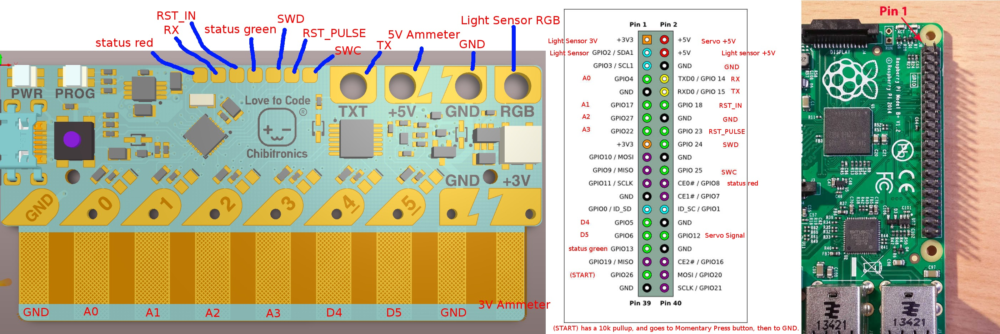

# Love to Code ChibiChip Operating System

## Getting Started

We assume you are building on a Raspberry Pi (so ARM-native) device,
and using gcc6. 

1. Check out https://github.com/chibitronics/ltc-os.git
2. Check out the build tag.  For example, version 1.9.0 has a tag of "ltc-p1-1.9.0"
3. Change to the "orchard" dir
4. Run "make LTC_HW_VERSION=PVT1C TRGT=arm-none-eabi-".  If you're compiling it on the Raspberry Pi itself, you can omit the "TRGT=" argument.
5. If you get a complaint about stubs-soft.h, create an empty file of that name in the directory where the error message
is pointing to and the error will go away.

The build result will be "build/orchard.elf", an object file that can be
loaded using openOCD into the ChibiChip.

## Connecting the SWD via OpenOCD

We'll use the GPIOs on the Raspberry PI to communicate with LTC over
the SWD bus to load the firmware.

Above is a comprehensive wiring diagram for the production automatic tester. To simply load the OS, the only
pins you want to connect to are "SWD" and "SWD":

* Connect SWD to "GPIO 24"
* Connect SWC to "GPIO 25"
* It's recommended to connect RST_IN to "GPIO 18"
* Connect a GND

If you don't feel like soldering headers onto the LTC board, you can use a "debug shoe" which you can print using a 3D printer.
It's available at: http://www.thingiverse.com/thing:2211948

You need to compile OpenOCD from source, and enable "bcm2835gpio".  Install the toolchain.  If you're using Raspbian, it's something like this:

 sudo apt-get install build-essential libtool gdb which
 git clone --recursive git://git.code.sf.net/p/openocd/code openocd
 cd openocd
 ./bootstrap
 ./configure --enable-bcm2835gpio --enable-sysfsgpio --disable-werror
 make
 sudo make install

Then, run OpenOCD:

 sudo /usr/local/bin/openocd \
  -f interface/raspberrypi2-native.cfg \
  -c "transport select swd" \
  -f target/kx.cfg \
  -c "reset_config none" \
  -c "kx.cpu configure -rtos ChibiOS" \
  -c "init" \
  -c "reset halt"

## Loading the ELF File

In gdb, run "load [path-to-orchard]/build-pvt1c/orchard.elf" to upload the new OS to the board

## Attaching GDB for debugging

You should then be able to attach GDB.  From your Desktop, run:

 arm-none-eabi-gdb -ex "target remote 192.168.xxx.xxx:3333" [platformio-generated-elf].elf

To look at OS threads in GDB, add the orchard.elf symbols using: "add-symbol-file [path-to-orchard.elf] 0".

You should now be able to look at threads using "info thr", and change threads with "thr [pid]".

